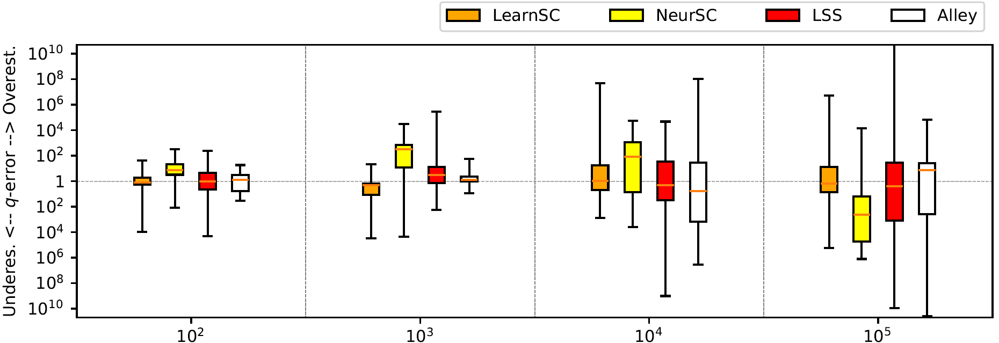
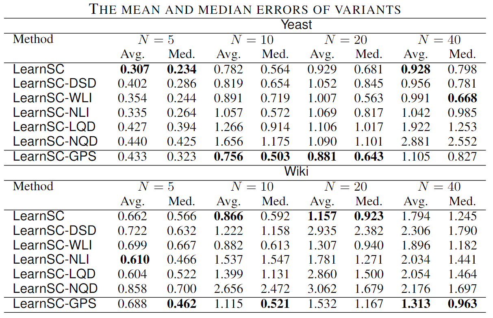

# Technical Report 

This is a technical report for   *LearnSC: An Efficient and Unified Learning-based Framework for Subgraph Counting Problem*

## Proof of Lemma 1

The domination part of the time cost of  Algorithm 1 is the $\mathsf{RandomWalkDecoposition}$ subroutine as the time complexity to construct skeleton $K$ is $O(|V_K|^2)$ and $|V_k|$ usually is much smaller than $|V_Q|$ in query graph $Q$.
For $\mathsf{RandomWalkDecoposition}$ subroutine, it takes $O(|V_Q|^2)$ at worst-case, i.e., it repeats $|V_Q|$ iterations, and generates an induced graph with all nodes in $Q$ at each iteration.
Hence, the time complexity of Algorithm 1 is $O(|V_Q|^2)$.

## Proof of Lemma 2

Algorithm 2 consists of three parts: (i) candidate filtering (Line 1), (ii) reduced graph generating (Lines 2 to 7), and (iii) connected components finding (Line 8).
As proved at [1], the cost of part (i) is $O(|V_Q|\cdot |V_G| + \sum_{u\in V_Q}\sum_{v\in V_G}(d(u)\cdot d(v)))$.
The time complexity of part (ii) is $O(|E_Q| \cdot |V_G|^2)$, i.e., for each edge in $Q$ (at Line 4), every node pair in $G$ will be verified, which takes $O(|V_G|^2)$ (at Line 5).
The time complexity to part (iii) is $O(|E_G|+|V_G|)$ as none of edge in $G$ is pruned in the reduced graph $rG$ at worst-case.
The summation of the cost of these three parts is the total time cost of Algorithm 2.

## Total Time Complexity of $\textsf{ LearnSC}$

We now consider the total time complexity of $\textsf{ LearnSC}$. We follow the five phases of $\textsf{ LearnSC}$ to compute the time complexity.

Decomposition phase contains the decomposition of query graph and data graph. As for query decomposition, we perform random walk on unvisited edges, the time complexity is $O(|E_Q|)$. When decomposing data graph, The complexity of GraphQL candidate filter is related to the number of enumeration times which is set to 1 in $\textsf{ LearnSC}$. In such setting, it is proven to be in the time complexity of $O(\cdot|V_Q|\cdot |V_G| + \sum_{u\in V_Q}\sum_{v\in V_G}(d(u)\cdot d(v)))$ [1]. After obtaining candidates, the removal of redundant edges is finished together with getting connected component. $\textsf{ LearnSC}$ scan all the edges of data graph, and detect whether the endpoint is a candidate of query in a hash set, so the time complexity is $O(|V_G|\cdot \log|V_Q|) $. 

Representation phase is done with Graph Neural Networks, the complexity is $O(|E_G|+ |E_Q|)$. 

In interaction phase, the construction of inter-graph from filtered candidates is in complexity of $O(|V_G|\cdot |V_Q|)$ in the worst case, in such case, the complexity of the GNN applied on inter-graph is also in complexity of $O(|V_G|\cdot |V_Q|)$. 

In estimation phase, the readout vectors of subqueries and substructures are convert into a scalar within the time complexity of $O(|\mathcal{G}|\cdot|\mathcal{Q}|)$. 

The complexity of aggregation phase is $O(|\mathcal{G}|\cdot|\mathcal{Q}|)$.
As a result, the total complexity of $\textsf{ LearnSC}$ is $O(|E_G|\cdot|E_Q|+|V_G|\cdot|v_Q|)$. 

## Accuracy varying data graph size$

## Variants of $\textsf{LearnSC}$

## Reference

[1] Huahai He and Ambuj K. Singh. Graphs-at-a-Time: Query Language and Access Methods for Graph Databases. SIGMOD. 2008. 405–418.
